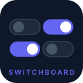

# Switchboard



Feature Toggle Server — manage boolean feature flags across your microservices.

## Stack

- Java 21 · Spring Boot 3.4.4 · Undertow
- MySQL 8 · Flyway · Spring Data JPA
- ULID public IDs · RFC 7807 error responses

## Running locally

**Start the database:**

```bash
docker compose up -d
```

**Start the server:**

```bash
cd toggle-server
./mvnw spring-boot:run
```

Server runs on `http://localhost:8080`.  
Adminer (DB admin) on `http://localhost:8081`.

## API

### Create a toggle

```http
POST /toggles
Content-Type: application/json

{
  "name": "my-feature",
  "ownerServiceName": "order-service",
  "enabled": true,
  "value": {
    "type": "STRING",
    "raw": "variant-a"
  }
}
```

`value` is optional. When provided, `type` must be `STRING` or `NUMBER`.

**201 Created**

```json
{
  "id": "01JPXYZ...",
  "name": "my-feature",
  "ownerServiceName": "order-service",
  "enabled": true,
  "version": 1,
  "updatedAt": "2026-04-21T17:00:00",
  "value": {
    "type": "STRING",
    "raw": "variant-a"
  }
}
```

`value` is omitted from the response when the toggle has no value.

**Errors** follow [RFC 7807](https://datatracker.ietf.org/doc/html/rfc7807) (`application/problem+json`):

| Status | Cause |
|--------|-------|
| 400 | Missing or blank required fields, or invalid `value.type` |
| 409 | Toggle already exists for that name + service |

## Testing

```bash
cd toggle-server
./mvnw test
```

## Importing the API collection

Import `insomnia-collection.json` into Insomnia to test the endpoints.

.